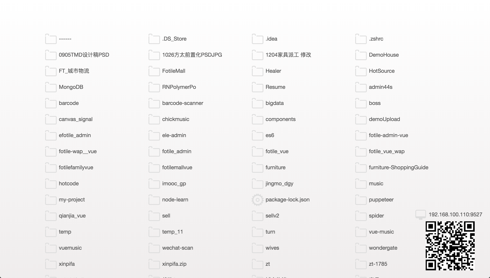
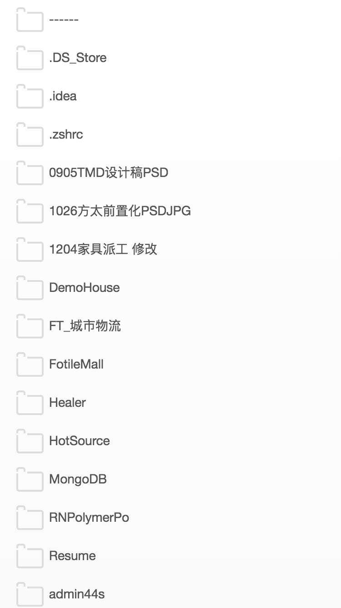

# wondergate
Node.js Static Web Server

## 安装

```
npm i -g wondergate
```

## 使用方法

```
wondergate # 把当前文件夹作为静态资源服务器根目录

wondergate -p 8080 # 设置端口号为 8080

wondergate -h localhost # 设置host 为 localhost

wondergate -d /usr # 设置跟目录为/usr
```

## Todo
- [X] 【bug】手机扫码打开后不显示二维码(通过npm install -g安装后全局使用时)
- [x] 【feature】增加显示启动的本地服务的IP地址与二维码
- [x] 【bug】中文文件url转译后打不开
- [x] 【feature】端口占用自动找未占用的端口
- [x] 【bug】命令行工具没有打包js(命令行工具找不到js文件)
- [x] 【feature】优化界面
- [ ] 【bug】中文文件乱码
- [ ] 【feature】移动端打开html自动加载注入vconsole
- [ ] 【feature】修改文件自动刷新浏览器
- [ ] 【optimize】删除多余css

## 展示
### PC

### Mobile


